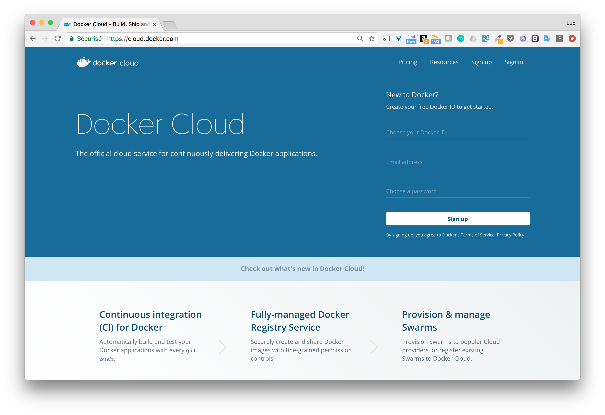
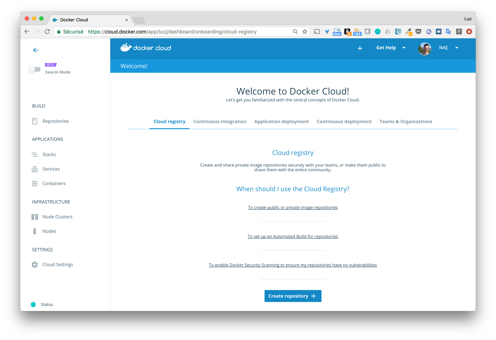
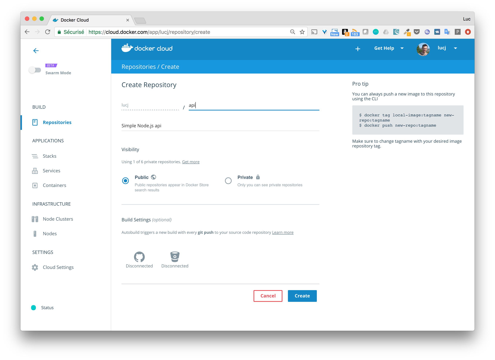
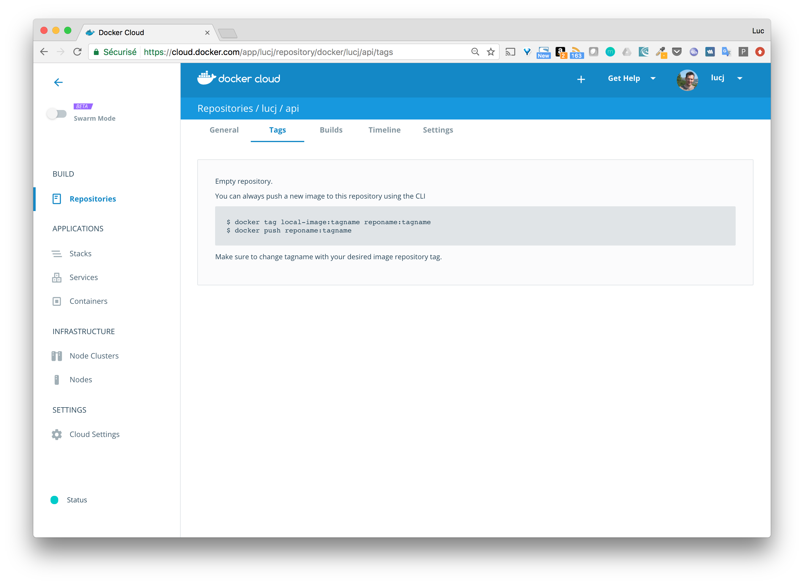
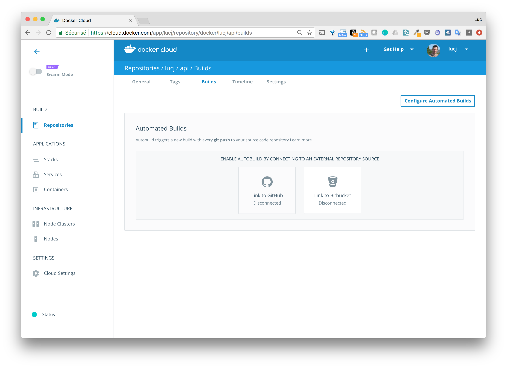

# Docker Cloud

Docker Cloud is 100% web based CaaS (Container as a Service) platform hosted by Docker which allows to easily manage containerized applications.

It allows to:

- create image repositories (the place where the versions of the images are stored)
- configure a continuous integration pipeline triggering the creation of an image and some application testing when code is pushed to source control
- create an application and deploy it on the infrastructure of several cloud providers
- setup a continuous deploiement pipeline which automates the deploiement of the application once the tests passed

On top of this, Teams and Organizations can be created so applications components and their underlying infrastructure can be isolated from each other.

In short, Docker Cloud allows to setup a fully CI/CD pipeline in an easy and secure way.

Still in beta version at the date of this writing is the management of a fleet of swarm directly within Docker Cloud. This feature will be developed later in this section.

## Login

The interface is available at [https://cloud.docker.com](https://cloud.docker.com). If you already have an account on Docker Hub, the same credentials must be used.



When logged on, the interface shows a menu on the left (we'll go through those elements later on) and a main panel with several tabs. Each of the tab details a step to deploy an application and its full CI/CD pipeline in the cloud.



To help in the setup, each tab also provides links towards [Docker online documentation](https://docs.docker.com).

## Creation of the repository

From the first tab (the default one), we can create repository which will hold our images.

Let's create a repository named `api` that we will use to store the images of a simple Node.js api.

At this stage, there is not a lot of information to provide, we only need:
- the name of the repository
- a optional description
- the visibility of the repository (we leave the default value (`public`) so that anyone can use it)



Once it's created, we have the following information.


## Setup the continuous integration

From the screenshot above, we can see there are several tabs that will help us to get information and configure the repository.

- The `general` tab which provides basic information of the repository

- The `tags` tab shows the different tags (image version) pushed to the repository. As no image have been pushed yet, there is no tag and we are explained how an image can be pushed.



- The `build` tab is an interesting one as it allows to setup an automated build of the image (we will be able to trigger a build of the image each time some code is pushed to a [GitHub](https://github.com) or [Bitbucket](https://bitbucket.org/) repository.



### Setup the automated build

Before we can do that, we need to link our source provider to Docker Cloud. As the source code of our Node.js api is in GitHub, we link a GitHub account. Clicking the `Link with GitHub` icon, the `Source providers` section of the `Cloud Settings` menu is opened. From there we can connect our GitHub account to Docker Cloud.


Once the account is linked, we can go back to the `build` tab of our `api` repository and select the GitHub repository of our application.

The `Autobuild` rule is activated by default. We just need to specify the `BUILD LOCATION` so it uses Docker infrastructure to build the image.

The Node.js api source code is available on GitHub in [https://github.com/lucj/api](https://github.com/lucj/api). Now the link is established between the GitHub repository and the Docker Cloud one, we can push some code to GitHub and observe how the image creation is triggered.

```
$ git push -u origin master
Counting objects: 7, done.
Delta compression using up to 8 threads.
Compressing objects: 100% (6/6), done.
Writing objects: 100% (7/7), 1.05 KiB | 0 bytes/s, done.
Total 7 (delta 0), reused 0 (delta 0)
To git@github.com:lucj/api.git
 * [new branch]      master -> master
Branch master set up to track remote branch master from origin.
```

IMAGES

### Setup the automated test

A push to GitHub triggers the creation of a new image, let's now go one step further and have some tests running on the newly created image.

A sample test has been added to the source code, basically it:
- runs the application
- send a request on the default endpoint
- check the application replies with a 200 HTTP Code

The test can be run locally with the command `npm test`.

```
$ npm test

> Travel@0.0.1 test /Users/luc/api
> mocha test/functional.js

  City
info: server listening on port 3000
info: new request at [2017-05-30T12:27:24.661Z]
    ✓ should return a dummy city

  1 passing (50ms)
```

In order for the test to be run in Docker Cloud, we need to create a `docker-compose.test.yml` file which contains the service to run the test.

```
sut:
  build: .
  command: npm test
```

The tests will be run on the newly created image and, if successful, the image will be sent to the repository.
After a new push in GitHub, the following screenshots illustrate:
- the creation of the image
- the run of the test
- the push of the successfully tested image


IMAGES

In only a few steps, we have setup a continuous integration pipeline with Docker Cloud. Pretty neat !

## Manage the infrastructure

The third tab of the main panel is dedicated to the deploiment of the application. So let's see, how we can deploy the image we have created above.
As for the previous steps, we are provided a couple of link which details what needs to be done for our application to be deployed.

### Link Docker Cloud with a cloud provider

Docker Cloud allows to deploy an application on the infrastructure of the following cloud providers:

- [Amazon Web Services](https://aws.amazon.com)
- [DigitalOcean](https://digitalocean.com)
- [Microsoft Azure](https://azure.microsoft.com)
- [SoftLayer](http://www.softlayer.com)
- [Packet](https://www.packet.net)

From the `Cloud providers` tab of the `Cloud Settings` menu item, we connect DigitalOcean to our Docker Cloud account. This will allow us to create DO Droplet and deploy our application on them.

### Create a DigitalOcean droplet

Using the `Node Clusters` menu within the `Infrastructure` item in the menu on the left, we create one node selecting DigitalOcean as a provider. The type/size of the node needs to be provided as well, we will go for the smallest one.

IMAGE

Less than one minute after, the node is ready to run our application.

### Create a service

As defined in the Docker's documentation: "a service is a group of container that use the same IMAGE:TAG". Basically, a service is instanciated into one or more containers and can be scaled very easily.

Let's go ahead and create a new service based on the image we created in the previous steps.

The image of the service can be selected from several sources:
- templates that are presented by default
- images from the Docker Hub
- repositories created in our Docker Cloud account

We will go for the last option as the image we want to deploy is the one we created earlier in the `api` repository.

The menu on the right lists all the configuration that can be done on the service we are about to deploy:

- some general settings (service name, image the service is based on, deploiement strategy and constraints, restart policies, ...)
- some container's configuration options (entrypoint and command, RAM and CPU limits)
- the ports published
- the environment variables required
- configuration of volume so data are decoupled from the container's lifecycle

In order to create a service based on the `api`, we will provide the following pieces of information:

- the name of the image to use (`lucj/api:latest`). As we did not specify any tag when we create the image, `latest` is the default one.
- the name of the service
- a port published on the host (and mapped to the port 80 of the service)

A couple of seconds later, the service is in RUNNING state and ready to be used by the external world through the endpoint provided on the interface.

```
$ curl http://api.9443adc3.svc.dockerapp.io:8080
{"msg":"api-1 suggests to visit Isnozek"}
```

In the `APPLICATION` section of the menu on the right, we can see the services (only the `api` in this case), and the containers running on the node.

The details view of the container shows several tabs:
- the general view of the containers, meaning its configuration options
- the logs that allows to see the call we did above using curl
- the timeline of the action done on this container
- a terminal that allows to perform operation in the running container (which can be handy for debugging purposes)

From the service details, we can easily scale the number of containers. 

```
$ curl http://api-1.15179480.cont.dockerapp.io:32770
{"msg":"api-1 suggests to visit Guplebzuz"}
luc at neptune in ~
$ curl http://api-2.15179480.cont.dockerapp.io:32771
curl: (6) Could not resolve host: api-2.15179480.cont.dockerapp.io

luc at neptune in ~
$ curl http://api-2.806291e9.cont.dockerapp.io:32771
{"msg":"api-2 suggests to visit Zafipic"}
luc at neptune in ~
$ curl http://api-3.a5ead573.cont.dockerapp.io:32772
{"msg":"api-3 suggests to visit Buhdezo"}
```

#### Launching a load-balancer


## Handle Swarm mode cluster
