# What will be covered

* [What is Docker Cloud](#docker-cloud)
* [Sample application](#sample-application)
* [Login onto Docker Cloud](#login-onto-docker-cloud)
* [Traditional mode](#traditional mode)
  * [Creation of the repository](#creation-of-the-repository)
  * [Setup the continuous integration](#setup-the-continuous-integration)
    * [Setup the automated build](#setup-the-automated-build)
    * [Setup the automated test](#setup-the-automated-test)
  * [Application deployment](#application-deployment)
    * [Link Docker Cloud with a cloud provider](#link-docker-cloud-with-a-cloud-provider)
    * [Create a DigitalOcean droplet](#create-a-digitalocean-droplet)
    * [Create a service](#create-a-service]
    * [Launching a load-balancer](#launching-a-load-balancer)
  * [Continuous deployment](#continuous-deployment)
    * [From the service definition](#from-the-service-definition)
    * [Using a Stack file](#using-a-stack-file)
* [Swarm mode cluster](#swarm-mode-cluster)
  * [Creation of the registry](#creation-of-the-registry)
  * [Continous integration](#continous-integration)
  * [Swarm deployment](#swarm-deployment)
  * [Bringing our own swarm](#bringing-our-own-swarm)
* [Summary](#summary)

# Docker Cloud

Docker Cloud is 100% web based CaaS (Container as a Service) platform hosted by Docker which allows to easily manage containerized applications.

It allows to:

- create image repositories (the place where the versions of the images are stored)
- configure a continuous integration pipeline triggering the creation of an image and some application testing when code is pushed to source control
- create an application and deploy it on the infrastructure of several cloud providers
- setup a continuous deploiement pipeline which automates the deploiement of the application once the tests passed

On top of this, Teams and Organizations can be created so applications components and their underlying infrastructure can be isolated from each other.

In short, Docker Cloud allows to setup a fully CI/CD pipeline in an easy and secure way.

Still in beta version at the date of this writing is the management of a fleet of swarm directly within Docker Cloud. This feature will be developed later in this section.

# Sample application

To illustrate the usage of Docker Cloud, we will consider a sample Node.js api that exposes a single endpoint and retuns a json message inviting you to visit a random city.
The code is available on [https://github.com/lucj/api](https://github.com/lucj/api). Basically, the application is composed of:

- app.js: definition of the http server
- index.js: entry point which calls app.js
- package.json: list of the application dependencies, definition of the `start` and `test` actions.
- Dockerfile
- test: folder containing a simple test scenario

# Login onto Docker Cloud

The Docker Cloud interface is available at [https://cloud.docker.com](https://cloud.docker.com). If you already have an account on Docker Hub, the same credentials must be used.


When logged on, the interface shows a menu on the left (we'll go through those elements later on) and a main panel with several tabs. Each of the tab details a step to deploy an application and its full CI/CD pipeline in the cloud.

To help in the setup, each tab also provides links towards [Docker online documentation](https://docs.docker.com).

# Traditional mode

## Creation of the repository


From the `Cloud registry` tab, we can create repository which will hold the images of our Node.js api. Let's create a repository and name it `api`.

At this stage, there is not a lot of information to provide, we only need:
- the name of the repository
- a description (optional)
- the visibility of the repository (we leave the default value (`public`) so that anyone can use it)


Once it's created, the `general` tab which provides basic information of the repository


The `tags` tab shows the tags (each tag representing a version of the image) pushed to the repository. As no image have been pushed yet, the list is empty.
We are also provided the command to use in order to push an image to the repository.


## Setup the continuous integration

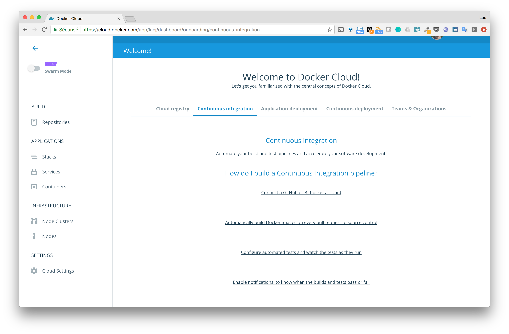

From detailed view of the repository, the `build` tab is an interesting one as it allows to setup an automated build of the image. The idea behind this is to be able to trigger a build of the image each time some code is pushed to the corresponding repository of the underlying source control system ([GitHub](https://github.com) or [Bitbucket](https://bitbucket.org/)).

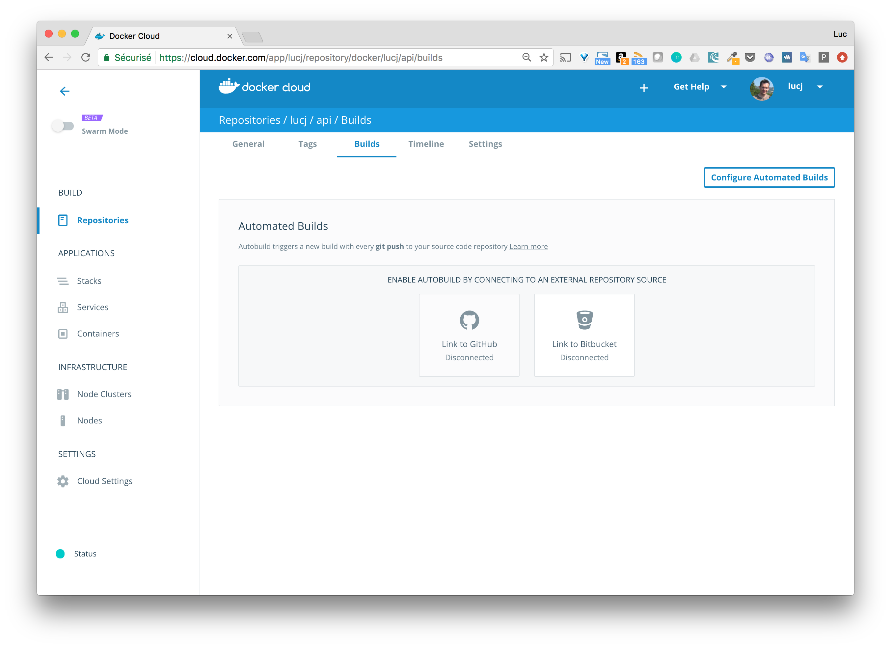

### Setup the automated build

As the source code of our Node.js api is in GitHub, we need to link the GitHub account to the Docker Cloud account. When we click on the `Link to GitHub` icon, we have access to the `Source providers` section of the `Cloud Settings` menu. From there we can easily connect both accounts.


Once this is done, we can go back to the `build` tab of the `api` repository and configure the build as follow:

- SOURCE REPOSITORY: select the GitHub repository which holds the source code (lucj/api in this example).
- BUILD LOCATION: make it use the smallest machine of the Docker infrastructure
- DOCKER VERSION: we use the default value (latest Docker EE)
- AUTOTEST: we leave this option deactivated for now on, we will use it in a next step
- BUILD RULES: this is where the magic happens. By default, each push on the master branch in GitHub will result in the build of the `latest` tag of the image. By default, the Dockerfile is expected to be at the root of the project repository. The `Autobuild` option is also enabled by default (which makes sense as we want to setup an automated build).

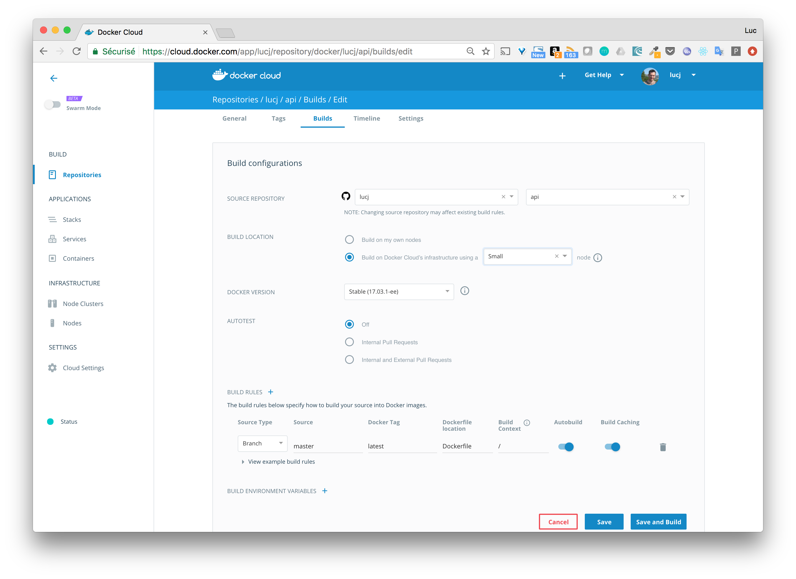

We can click on `Save` and we should have the automated build setup correctly.

Now the link is established between the GitHub repository and the Docker Cloud one, we can do some changes to the code and push it to GitHub. We will observe how the image creation is triggered.

```
$ git push -u origin master
Counting objects: 7, done.
Delta compression using up to 8 threads.
Compressing objects: 100% (6/6), done.
Writing objects: 100% (7/7), 1.05 KiB | 0 bytes/s, done.
Total 7 (delta 0), reused 0 (delta 0)
To git@github.com:lucj/api.git
 * [new branch]      master -> master
Branch master set up to track remote branch master from origin.
```

From the `build` tab of the repository's details, we can see the build goes from the `EMPTY` status


... to the `BUILDING` status...


... and finally to the `SUCCESS` status
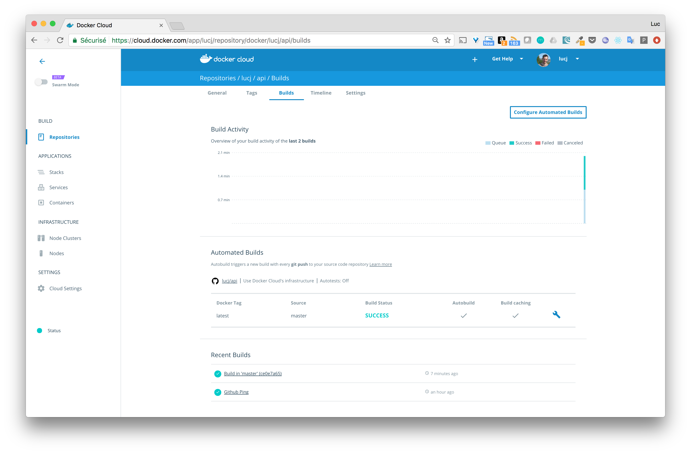

From the log of the build we can see all the instructions of the Dockerfile that were executed to build the image.

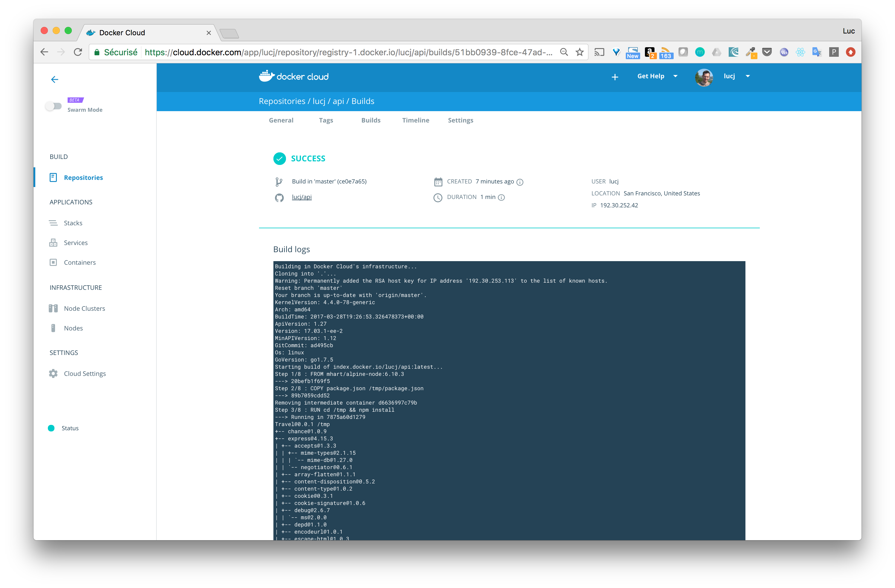

Going back to the repository, we can see the new tag that has been created.

Note: as we did not specified any tag, each time a new image is created, it will overwrite the last version (the one with the `latest` tag). This is just for the example as this is not a suitable approach in a enterprise environment.


From the `timeline` tab of the repository, we can see the history of the action performed. In the current state, we have linked the repository to GitHub and then triggered a build.


### Setup the automated test

At this stage, we have setup Docker Cloud in a way that a push to a GitHub's repository triggers the creation of a new image. Let's now go one step further and have some tests running on the newly created image.

The source code embeds a simple test scenario which:
- runs the application
- sends a request to the default endpoint
- check taht the application replies with a 200 HTTP Code

The test can be run locally with the command `npm test`.

```
$ npm test

> Travel@0.0.1 test /Users/luc/api
> mocha test/functional.js

  City
info: server listening on port 3000
info: new request at [2017-05-30T12:27:24.661Z]
    ✓ should return a dummy city

  1 passing (50ms)
```

In order for the test to be run in Docker Cloud, we need to create a `docker-compose.test.yml` file which contains a service named `sut` that runs the tests. In the current example, the docker-compose.test.yml file is pretty simple and contains only the following.

```
sut:
  build: .
  command: npm test
```

Note: if the application was dependent on other services, we would add them in the docker-compose.test.yml file as well.

In the `build` tab of the repository, we need to activate the `Autotest` option in order for the test to be run automatically.

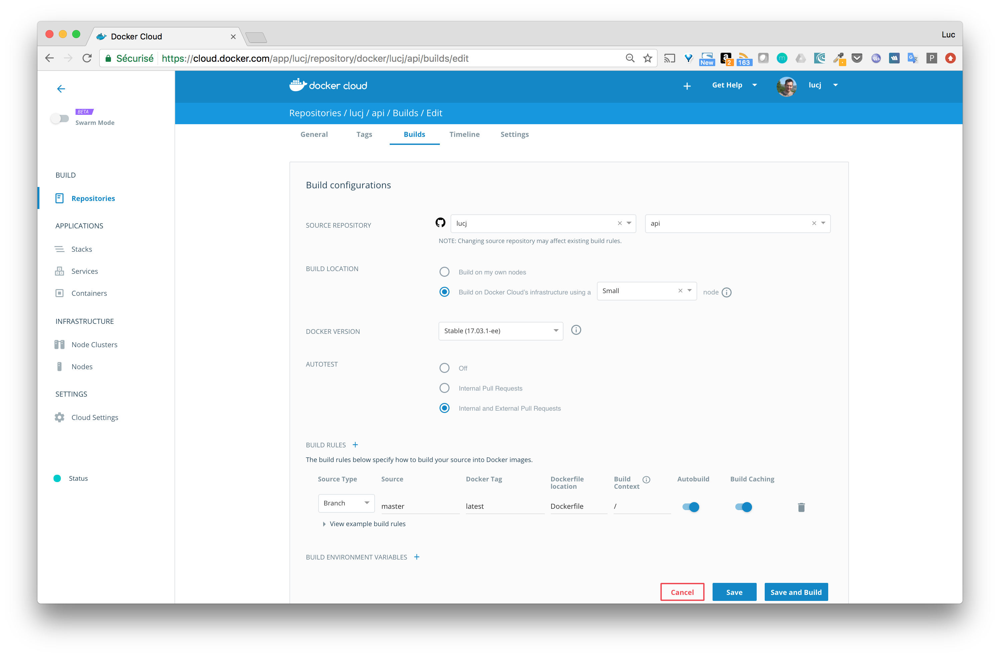

The workflow is the following one: 

- code is pushed to the GitHub repository
- the image is created
- the test are run on the new image
- if the tests are successfull, the image is pushed to the repository

The screenshot below illustrates the trigger of a new build.

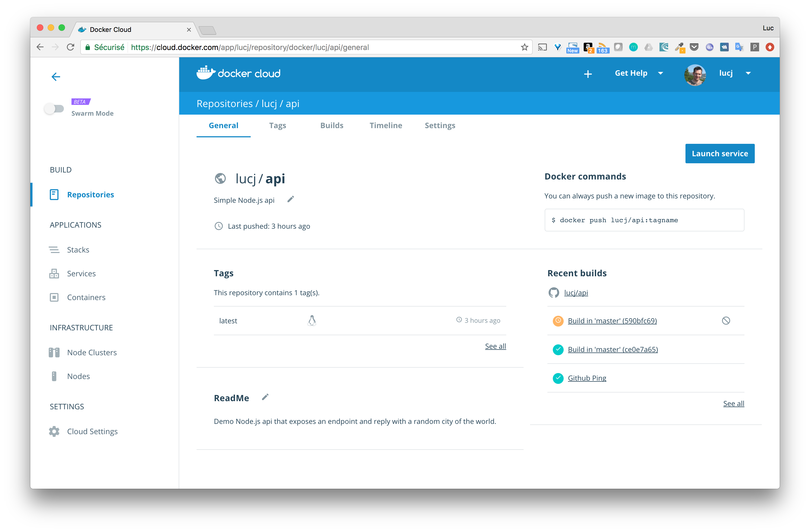

We can see from the build's log that the test are performed after the image is built. Then the image is pushed to the repository.

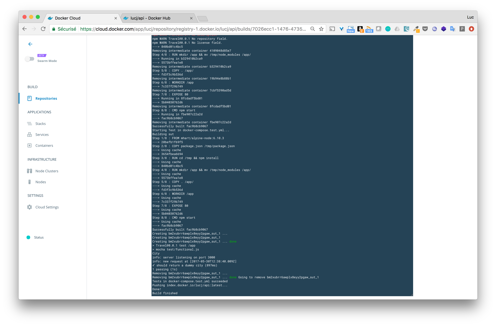

In only a few steps, we have setup a continuous integration pipeline with Docker Cloud. Pretty neat !

## Application deployment

The third tab of the main panel is dedicated to the deployment of the application.
As for the previous steps, we are provided a couple of link which details what needs to be done for our application to be deployed.

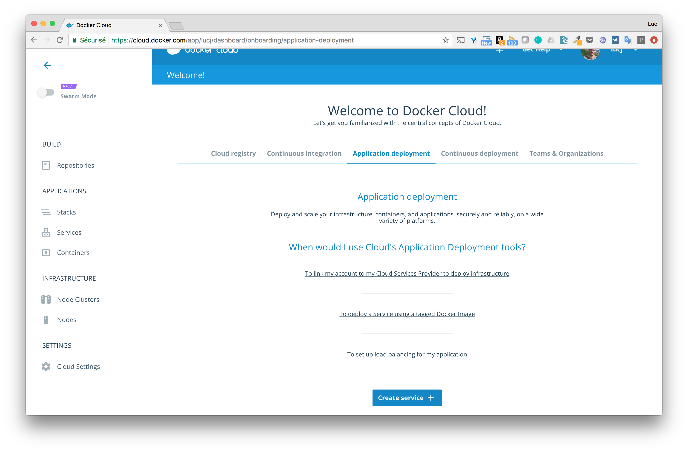

### Link Docker Cloud with a cloud provider

Docker Cloud allows to deploy an application on the infrastructure of the following cloud providers:

- [Amazon Web Services](https://aws.amazon.com)
- [DigitalOcean](https://digitalocean.com)
- [Microsoft Azure](https://azure.microsoft.com)
- [SoftLayer](http://www.softlayer.com)
- [Packet](https://www.packet.net)

From the `Cloud providers` tab of the `Cloud Settings` menu item, we connect DigitalOcean to our Docker Cloud account. This will allow us to create DO Droplet and deploy our application on them.

### Create a DigitalOcean droplet

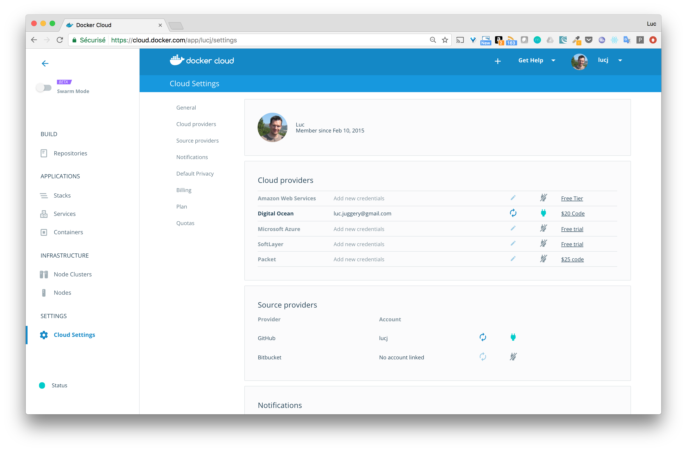

Using the `Node Clusters` menu within the `Infrastructure` item in the menu on the left, we create one node selecting DigitalOcean as a provider. The type/size of the node needs to be provided as well, we will go for the smallest one.

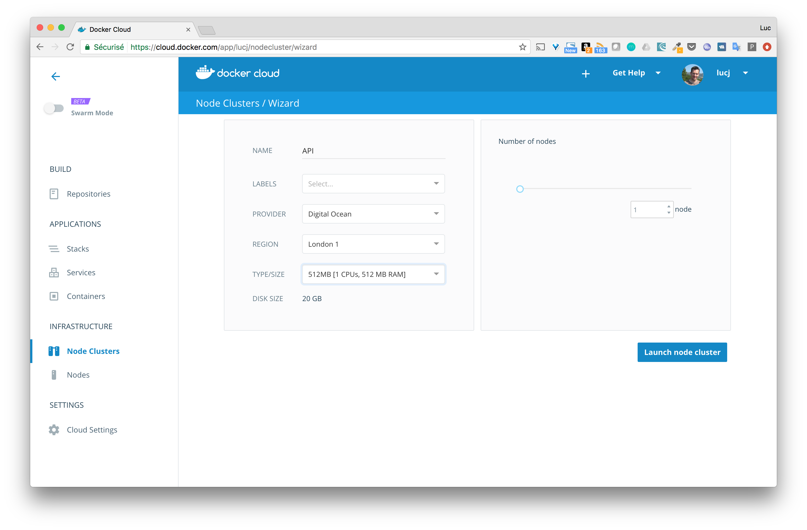

Less than one minute after, the node is ready to run our application.

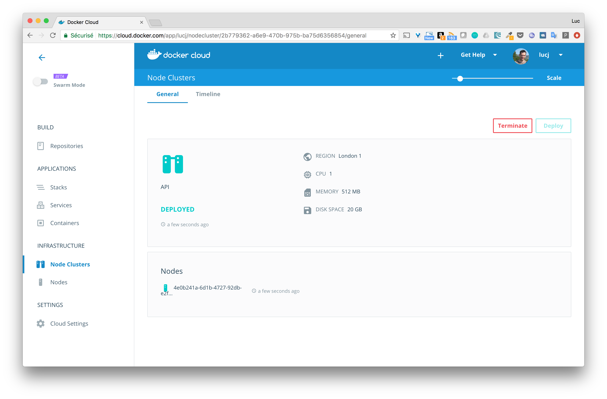

### Create a service

As defined in the Docker's documentation: "a service is a group of container that use the same IMAGE:TAG". Basically, a service is instanciated into one or more containers and can be scaled very easily.

Let's go ahead and create a new service based on the image we created in the previous steps.

The image of the service can be selected from several sources:
- templates that are presented by default
- images from the Docker Hub
- repositories created in our Docker Cloud account

We will go for the last option as the image we want to deploy is the one we created earlier in the `api` repository.

The menu on the right lists all the configuration that can be done on the service we are about to deploy:

- some general settings (service name, image the service is based on, deploiement strategy and constraints, restart policies, ...)
- some container's configuration options (entrypoint and command, RAM and CPU limits)
- the ports published
- the environment variables required
- configuration of volume so data are decoupled from the container's lifecycle

In order to create a service based on the `api`, we will provide the following pieces of information:

- the name of the image to use (`lucj/api:latest`). As we did not specify any tag when we create the image, `latest` is the default one.
- the name of the service
- a port published on the host (and mapped to the port 80 of the service)

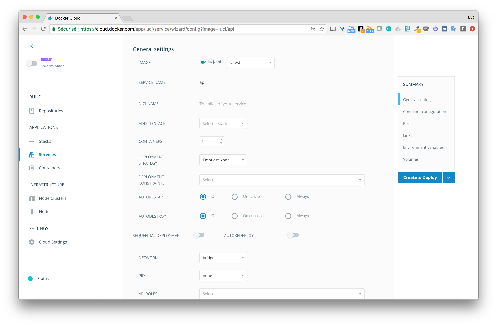

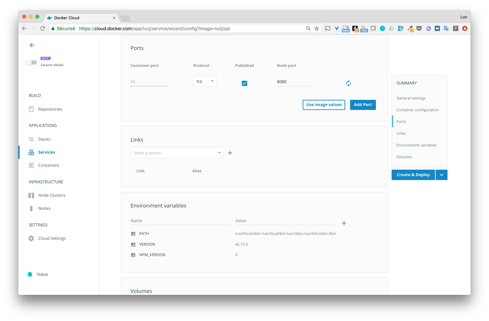

Note: from the publication of the port, the service will be available from the outside on the port 8080 of the host. We'll see later that using a static port is not a good solution as this will prevent the service to be scaled.

A couple of seconds later, the service is in RUNNING state and ready to be used by the external world through the endpoint provided on the interface.


```
$ curl http://api.9443adc3.svc.dockerapp.io:8080
{"msg":"api-1 suggests to visit Isnozek"}
```

The `Logs` tab show the logs of each container of the service. To differentiate the containers, each log entry is prefixed with the container's name. In the current example, only api-1 is listed as our service only have one container.

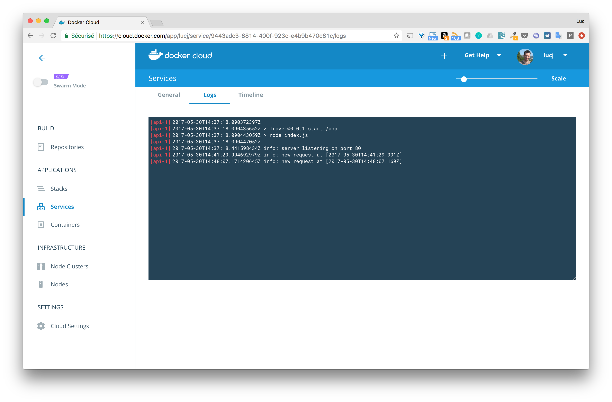

The `Timeline` tab displays the history of the service (actions such as start / stop / deploy / ...)


Going back the service's `General` tab or using the `Containers` menu in the `APPLICATION` section of the menu on the right, we can select the detailed view of the container that is running.

- the `General` tab displays the main configuration options

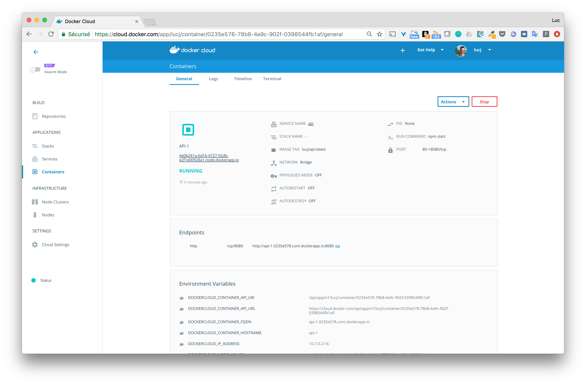

- the `Logs` tab displays.... the container's log


- the `Timeline` tab show all the action that happened on the container

- the `Terminal` tab provides a shell running in the container and allows to perform operations such as debugging related stuff

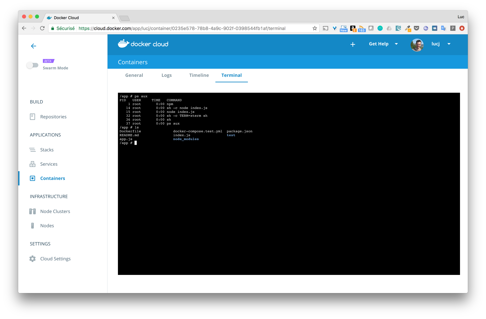

From the service details, we can easily scale the number of containers and set it to 3, let's give it a try and move the cursor so it reads 3.

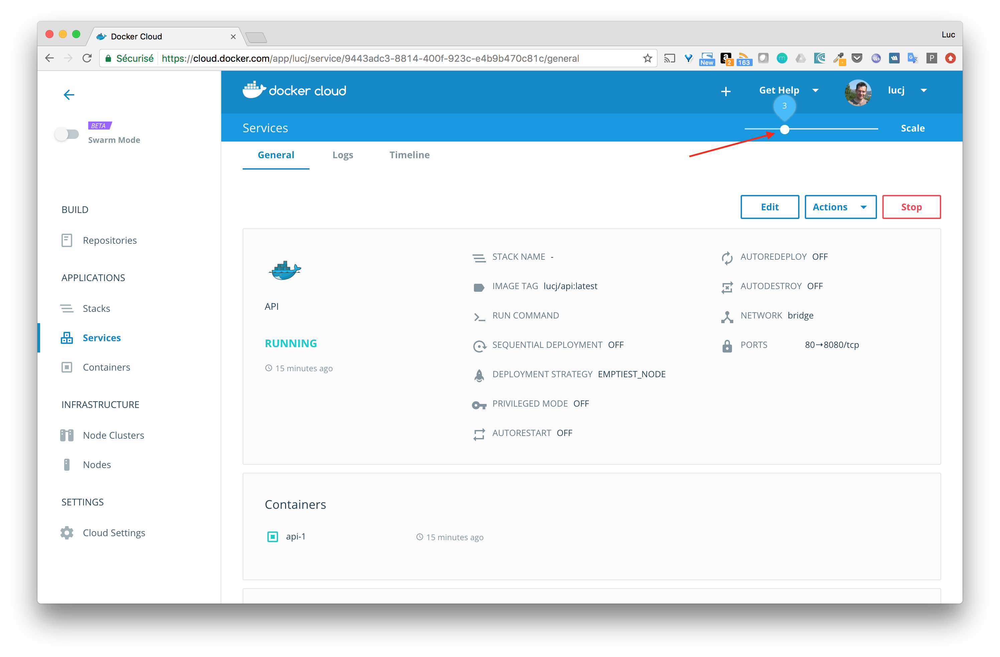

But wait... we get an error message. The details can be found in the service's timeline which tells us the service cannot be scaled because of a port conflict.

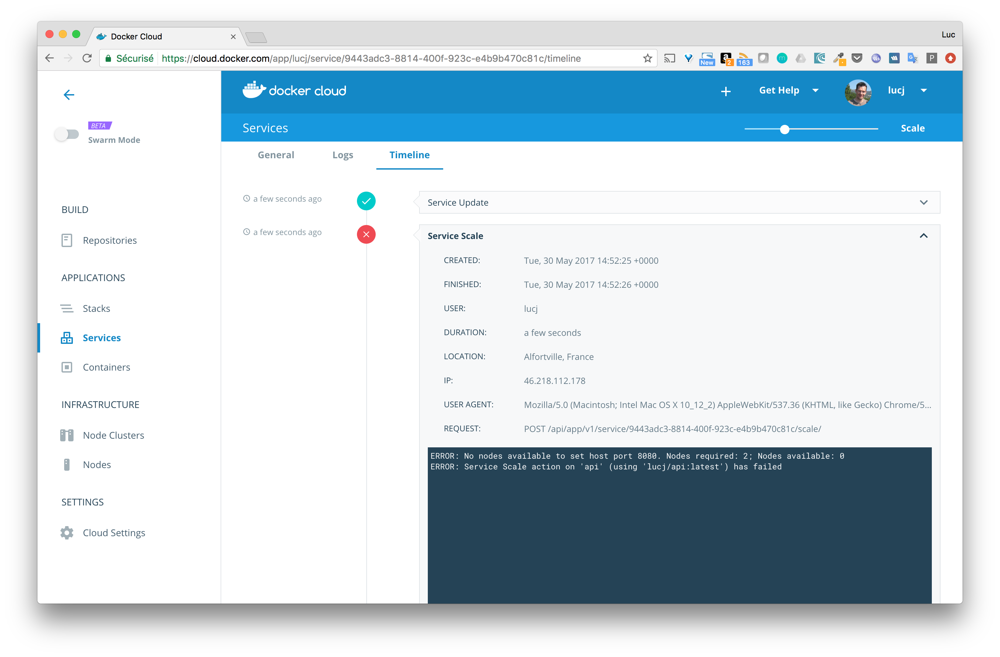

When we defined the service, we specified that each container exposes it's port (80) onto the port 8080 of the host. This does not raise any problem when only one container is running for the service but it's obviously an issue when several containers are running for the service as the same port on the host cannot be allocated to each one at the same time. Let's change that and specify a dynamic allocation of the port (so the Docker daemon will take care of which host's port to allocate for each service).


To clear things up, we restart the service and we can no see our 3 containers running. Each one is available from a different port on the host.


Each container has its own endpoint exposed to the outside

Container name | Container endpoint
---------------|-------------------
api-1          | http://api-1.15179480.cont.dockerapp.io:32770
api-2          | http://api-2.806291e9.cont.dockerapp.io:32771
api-3          | http://api-3.a5ead573.cont.dockerapp.io:32772

```
# Targetting api-1
$ curl http://api-1.15179480.cont.dockerapp.io:32770
{"msg":"api-1 suggests to visit Guplebzuz"}

# Targetting api-2
$ curl http://api-2.806291e9.cont.dockerapp.io:32771
{"msg":"api-2 suggests to visit Zafipic"}

# Targetting api-3
$ curl http://api-3.a5ead573.cont.dockerapp.io:32772
{"msg":"api-3 suggests to visit Buhdezo"}
```

In order for the incoming requests to be dispatched between the different containers of a service, we need to setup a load balancer in front of our service. This load balancer will also be defined as a service as we will see shortly.

### Launching a load-balancer

We create a service based on the `dockercloud/haproxy` image

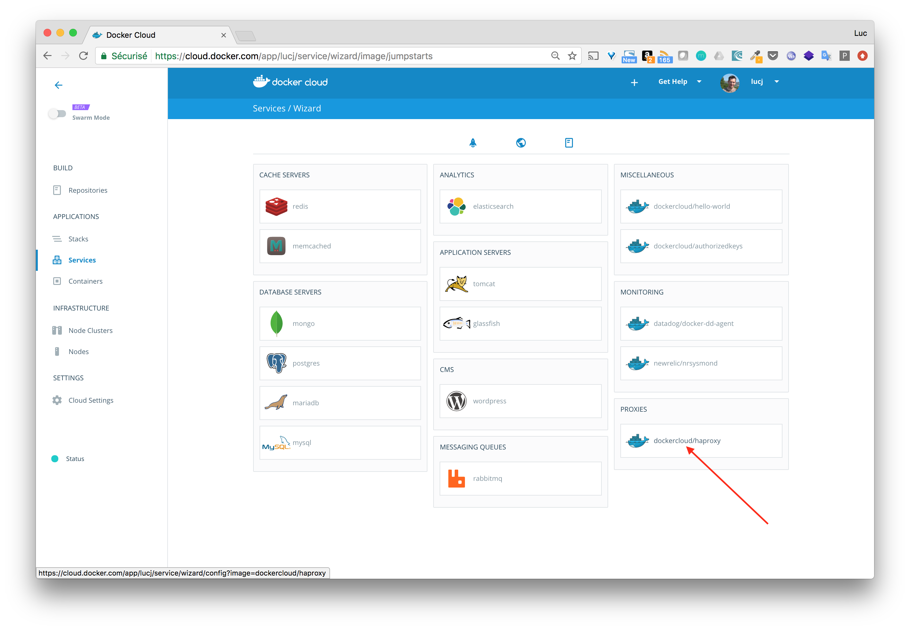

On top of the image used and the service name, there are a couple of options we need to specify during the creation step.
First, we need to give the service some special rights (`Full access`) so it can get event from the Docker daemon and reconfigure itself.

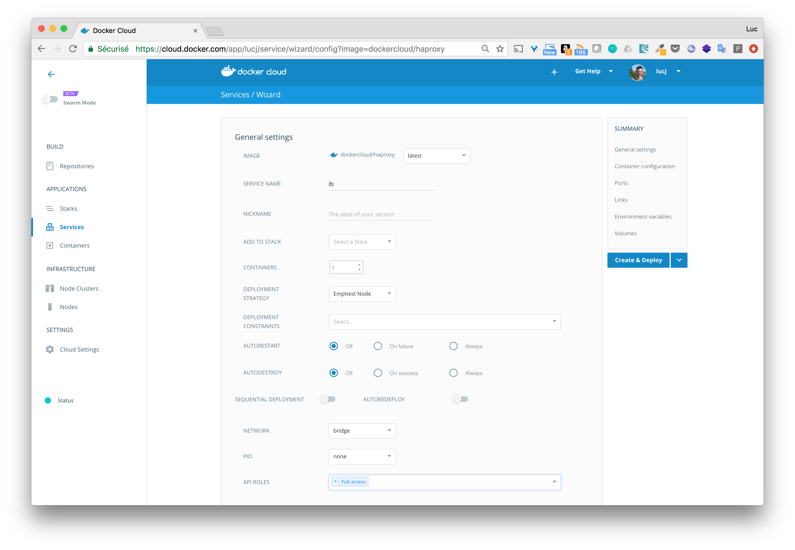

Next we publish the port 80 of the container to the port 80 of the host. As we will have only 1 container for the load-balancer there is no risk of conflict. We also need to link the `lb` service with the `api` one so the load balancer can dispatch request to the api's containers.

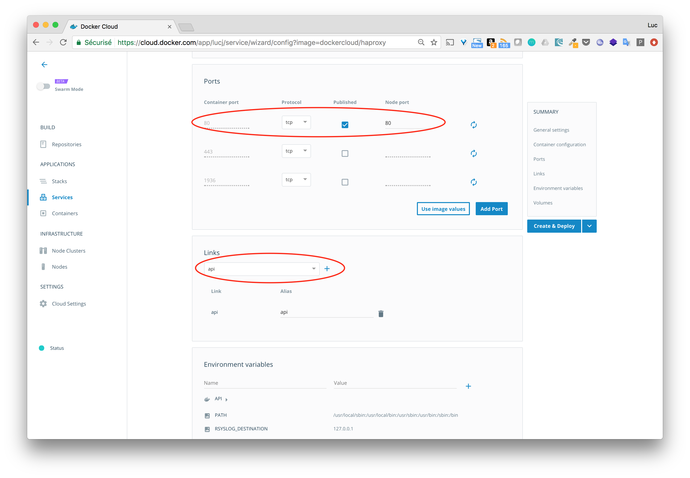

Once the load-balancer service is deployed, we can access it using the endpoint specified in the service's details.

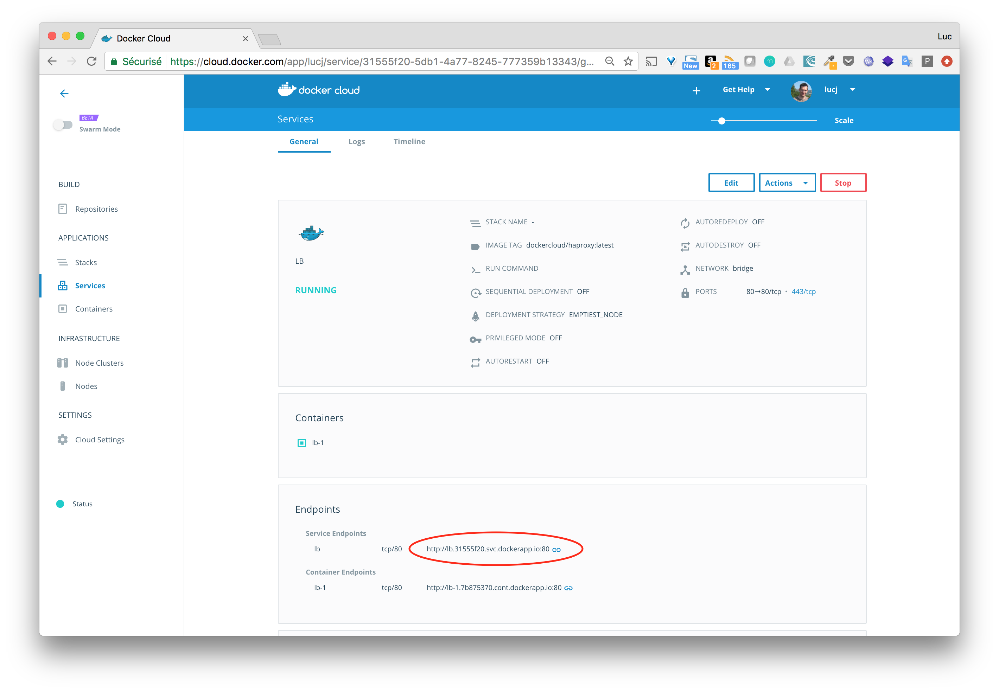

We can then send several requests in a row to the load balancer and have it dispaching the request in a roundrobin way to the containers of the api service.

```
$ curl http://lb.31555f20.svc.dockerapp.io
{"msg":"api-1 suggests to visit Lujwovja"}

$ curl http://lb.31555f20.svc.dockerapp.io
{"msg":"api-2 suggests to visit Gutuiji"}

$ curl http://lb.31555f20.svc.dockerapp.io
{"msg":"api-3 suggests to visit Rivhimac"}

$ curl http://lb.31555f20.svc.dockerapp.io
{"msg":"api-1 suggests to visit Guzogras"}
```

## Continuous deployment

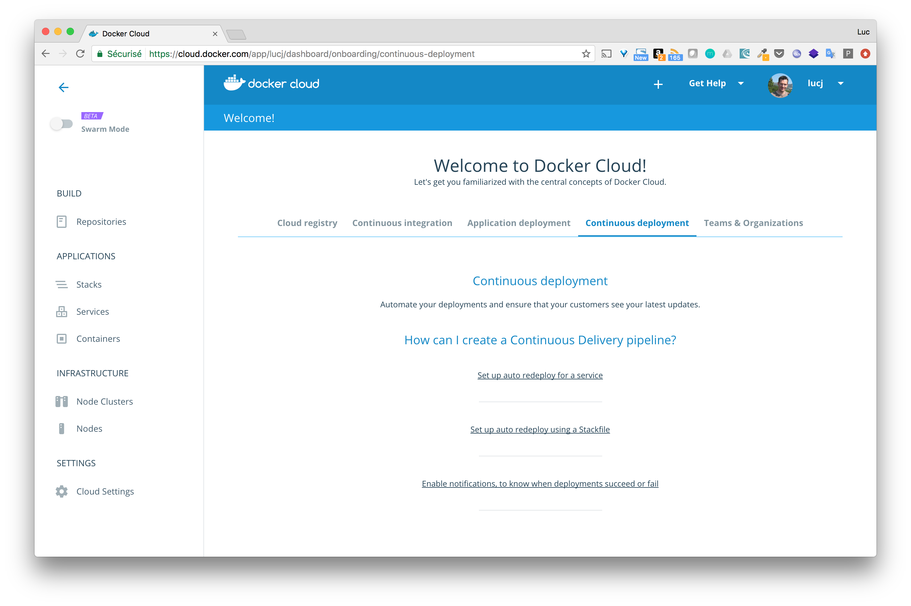

In the current status, we have automated the creation of an image, the tests, the push to a repository. We then use the image to create and deploy a service on the infrastructure of DigitalOcean. Let's go one step further again and deploy the changes after the images is available.

We can say that the whole application is composed of 2 services:
- the api
- the load balancer in front of it

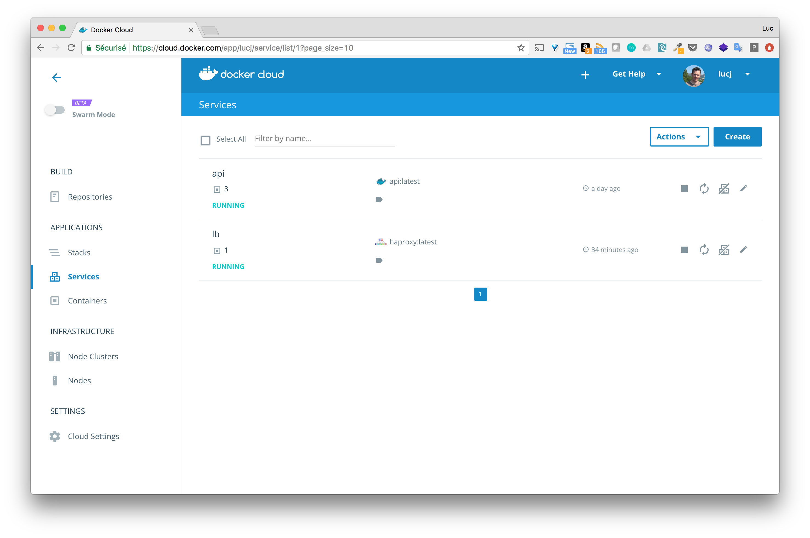

If the code of the `api` is changed, we want the whole CI/CD pipeline to be triggered until the point where running containers are replaced with new ones (based on the newly created image).

### From the service definition

We can activate the `Autoredeploy` option as illustrated on the following screenshot.

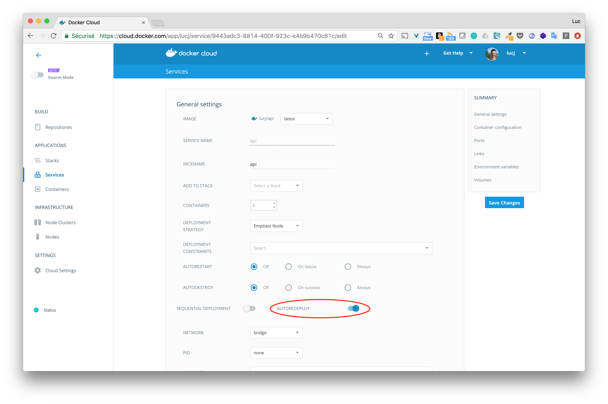

Pretty simple, isn't it ?

### Using a Stack file

An other way is to define the application as a stack, meaning a collection of services.
In order to do this, we will create a stack file named `docker-cloud.yml` containing the definition of our `lb` and `api` services.

```
lb:
  image: dockercloud/haproxy
  links:
    - api
  ports:
    - "8000:80"
  roles:
    - global
api:
  image: lucj/api
  target_num_containers: 3
  autoredeploy: true
```

We set the `autoredeploy` option to true, and specified 3 containers of the `api` should run by default.
Also, in order to avoid the conflict with the currently running application, the port of the load-balancer is mapped on the port 8000 of the host.

Note: all the possible options that can be used in a stack file are available in the [Stack file reference documentation](https://docs.docker.com/docker-cloud/apps/stack-yaml-reference/)

Let's deploy the stack through the `Stacks` section of the `APPLICATION` menu on the left.

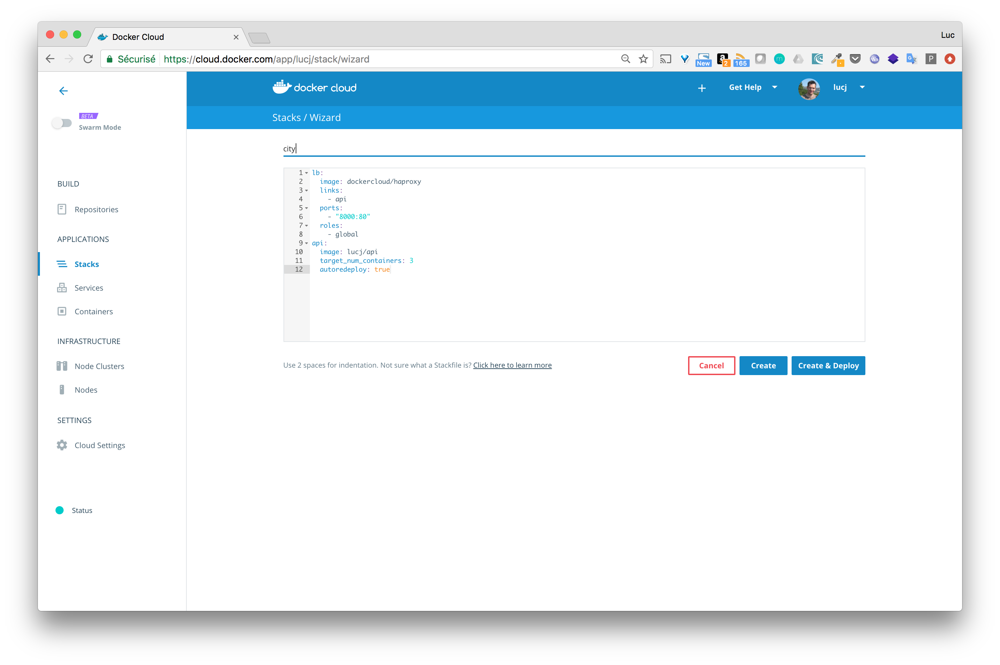

Once the stack is deployed, we can see the services that are part of it:
- lb
- api

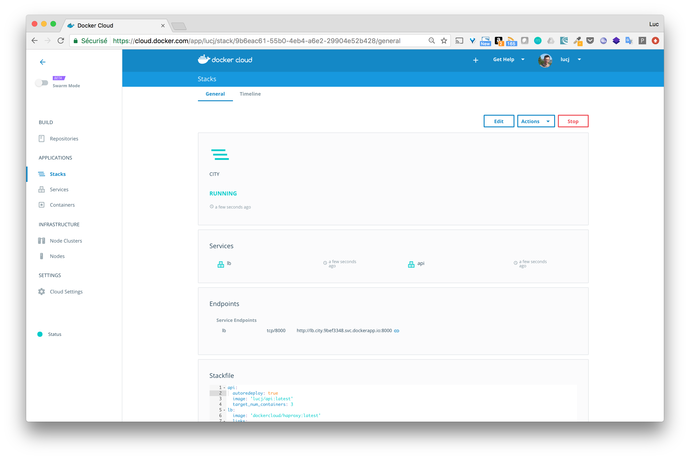

Going into the `api` service, we can see that 3 containers have been started.

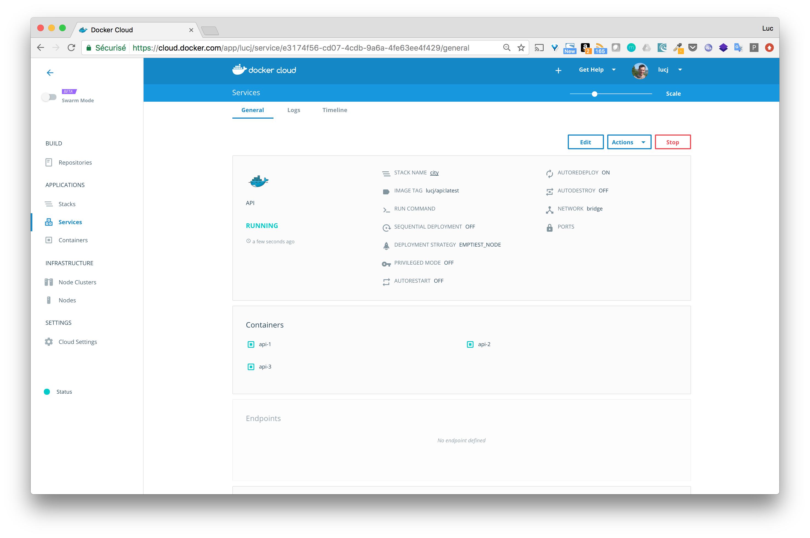

Using the endpoint provided in the stack, we can access the new instance of the application, as we have done previously, and the roundrobin in action.

```
$ curl http://lb.city.9bef3348.svc.dockerapp.io:8000
{"msg":"api-1 suggests to visit Irezivu"}

$ curl http://lb.city.9bef3348.svc.dockerapp.io:8000
{"msg":"api-2 suggests to visit Isuawzir"}

$ curl http://lb.city.9bef3348.svc.dockerapp.io:8000
{"msg":"api-3 suggests to visit Lebiuj"}
```

#  Swarm mode cluster

Still in beta at the time of this writing, the management of Swarm cluster is available within Docker Cloud.
In order to switch to Swarm mode, we just need to use the slider at the top left.

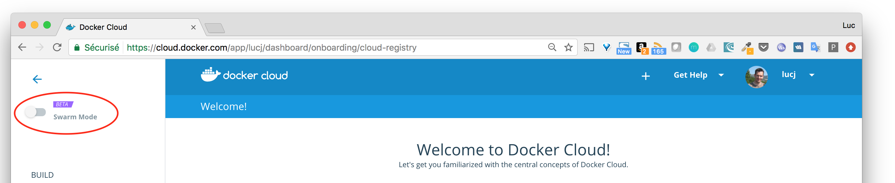

After switching to Swarm mode, we are presented 4 tabs in pretty much the same way as in the non swarm mode display.

## Creation of the registry

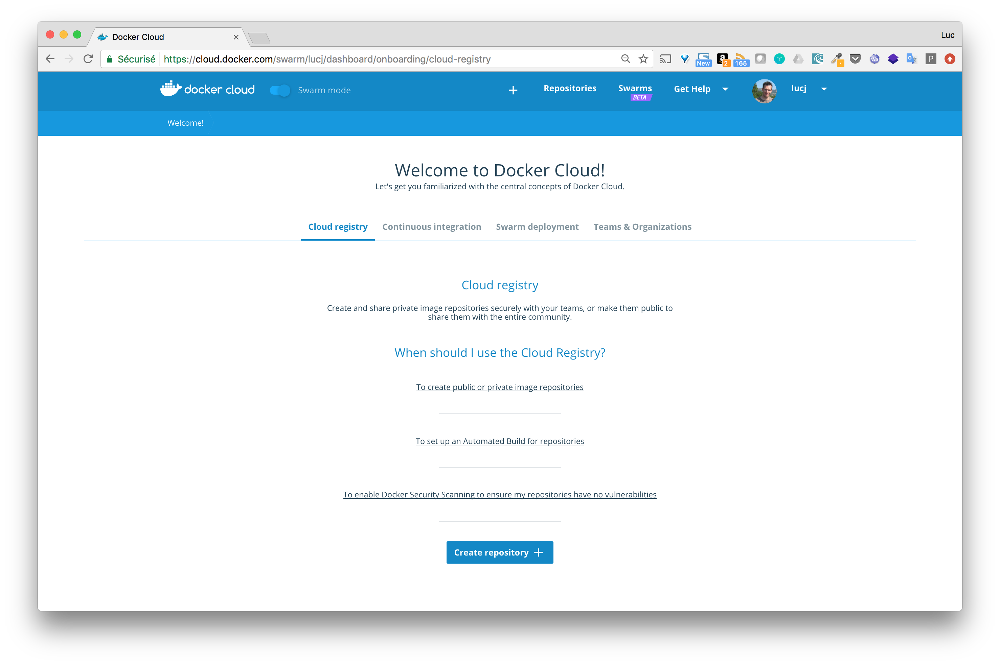

This refers to the same process of repository creation as the one we followed for the non swarm mode

## Continous integration

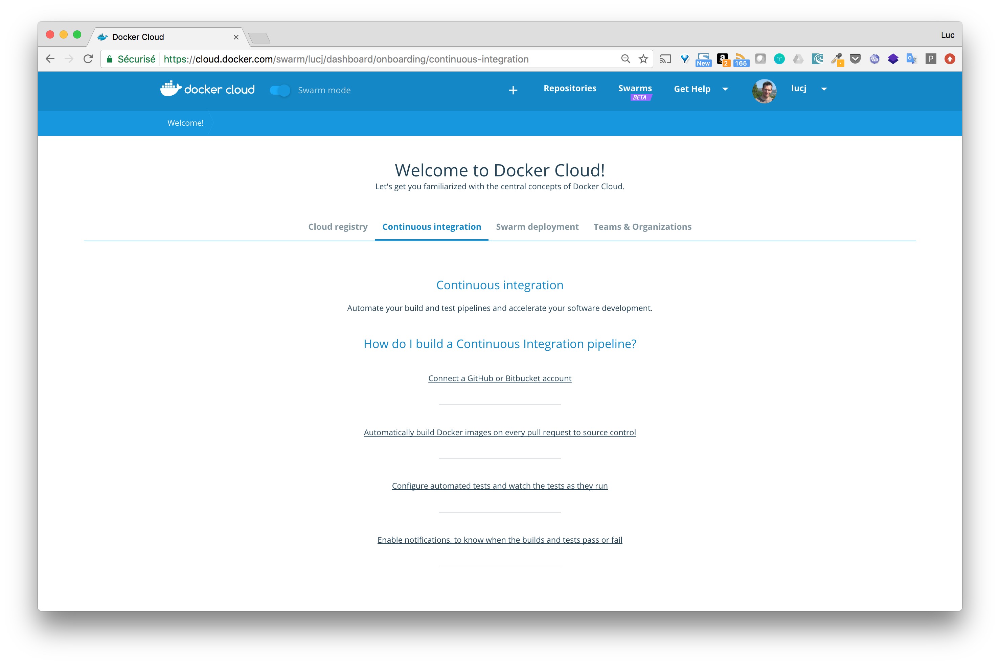

This refers to the same process as the one we followed for the non swarm mode

## Swarm deployment

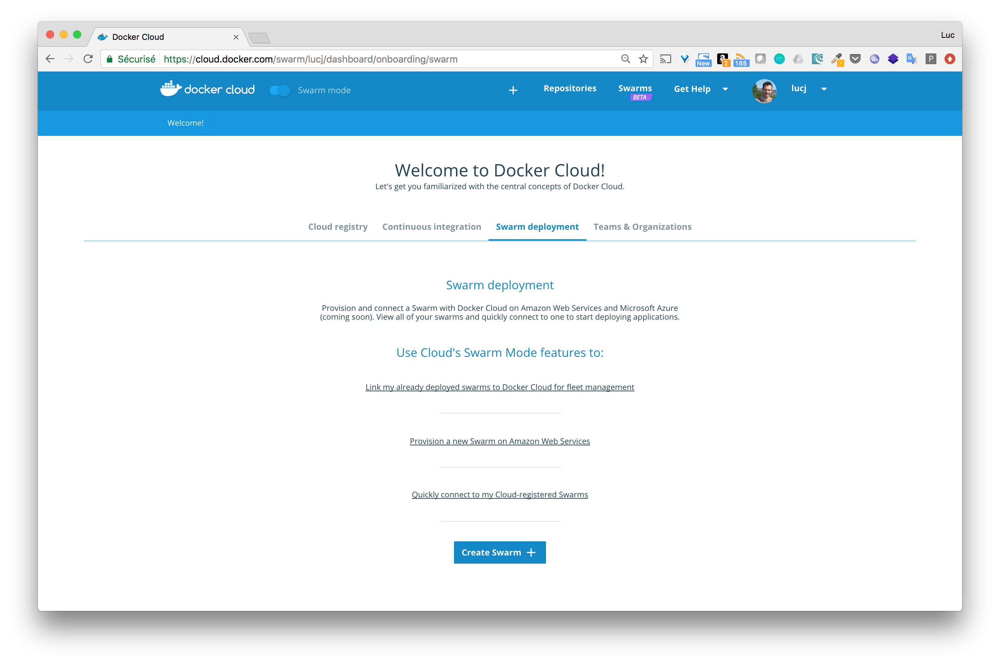

This tab is the most interesting one as it allows to create a swarm on AWS (Azure is about to come) directly from Docker Cloud. Let's see that in action.
The first thing to do is to follow the link provided to setup an AWS account within Docker Cloud (several steps to follow but not a too difficult process).

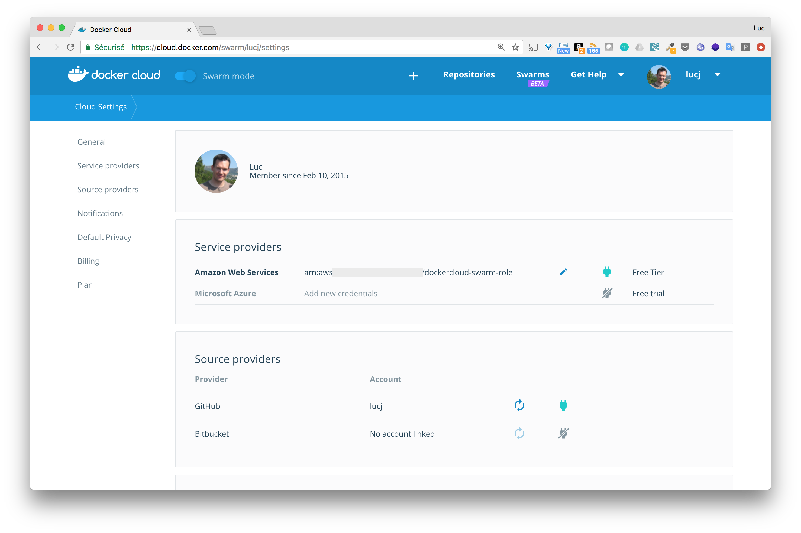

Onnce this is done we can go ahead and create a swarm. There are only a couple of parameters that need to be provided.

- Swarm name: lucj/api
- Swarm size: we go for a small, and not production ready one, specifying only 1 manager nodes and 2 worker nodes
- Service provider: AWS

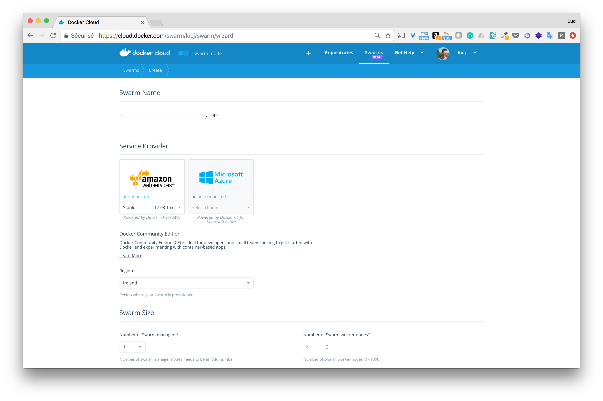

- Swarm properties: we specify a key to log onto the nodes if needed, and leave the other option with their default value
- Swarm Managers properties: we use the default value for instance type and volume type/size
- Swarm Workers properties: same as for the managers

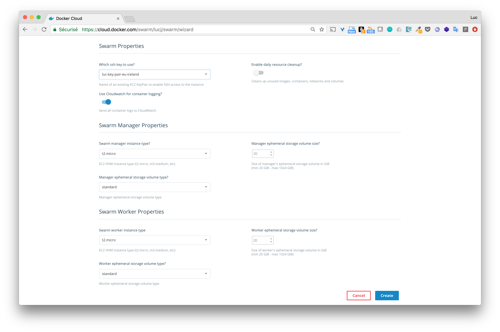

We the created the swarm that becomes available a couple of minutes later.

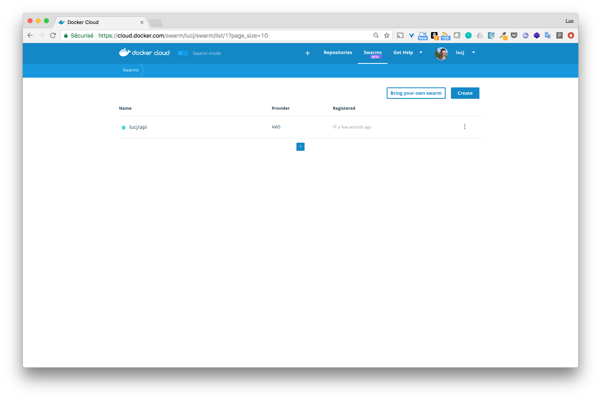

When clinking on the swarm name, we are provided the command to run locally in order to access it.

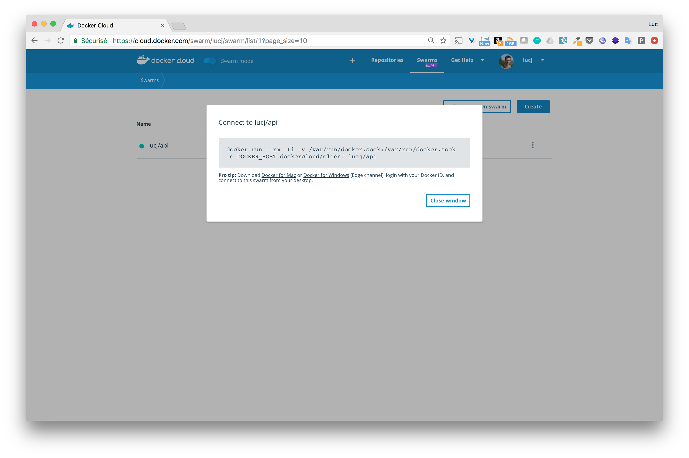

As I'm already running Docker for Mac, let's run this command locally.

```
$ docker run --rm -ti -v /var/run/docker.sock:/var/run/docker.sock -e DOCKER_HOST dockercloud/client lucj/api
Unable to find image 'dockercloud/client:latest' locally
latest: Pulling from dockercloud/client
79650cf9cc01: Already exists
3ebdf09b6cf8: Pull complete
3bc70ba90ba1: Pull complete
19aaa36bba7a: Pull complete
Digest: sha256:3de1aedf9d1f0972355b5705d2ba7952afc0652a8bf50dd573840460c8c400be
Status: Downloaded newer image for dockercloud/client:latest
Use your Docker ID credentials to authenticate:
Username: lucj
Password:

=> You can now start using the swarm lucj/api by executing:
    export DOCKER_HOST=tcp://127.0.0.1:32768
```

We can then export the DOCKER_HOST environment variable as specified and run a swarm related command.

```
$ export DOCKER_HOST=tcp://127.0.0.1:32768
```

Let's list the nodes:
```
$ docker node ls
ID                            HOSTNAME                                      STATUS              AVAILABILITY        MANAGER STATUS
n4xbvxm2w9u6dgcf6a79i9c8j     ip-172-31-25-135.eu-west-1.compute.internal   Ready               Active
n5rbpqp60obby5ihhaybmkspa     ip-172-31-40-108.eu-west-1.compute.internal   Ready               Active
onbhubvcv0smflyaj15arhk5o *   ip-172-31-31-226.eu-west-1.compute.internal   Ready               Active              Leader
```

Is there any service running ?
```
$ docker service ls
ID                  NAME                       MODE                REPLICAS            IMAGE                             PORTS
7fkdmwgbg6t3        dockercloud-server-proxy   global              1/1                 dockercloud/server-proxy:latest   *:2376->2376/tcp
```

Even if we did not specified any service, this one is a system service that allow to manage the swarm via Docker Cloud.

We then have access to our swarm and can deploy services on it.

## Bringing our own swarm

If we already have a swarm running, it's possible to bring it to Docker Cloud. It only requires to run the command provided on a manager as illustrate below.

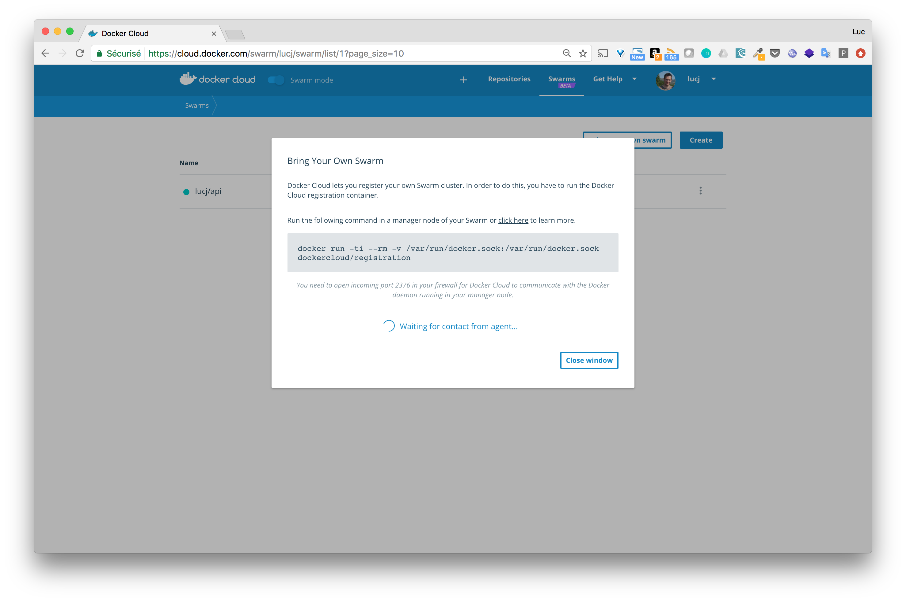

We will illustrate that by creating a one node swarm on DigitalOcean. For this we use Docker Machine.

```
$ docker-machine create \
→   --driver digitalocean \
→   --digitalocean-access-token=${L_TOKEN} \
→   --digitalocean-image=ubuntu-16-04-x64 \
→   --digitalocean-size=1gb \
→   --digitalocean-region=lon1 \
→   node01
Running pre-create checks...
Creating machine...
(node01) Creating SSH key...
(node01) Creating Digital Ocean droplet...
(node01) Waiting for IP address to be assigned to the Droplet...
Waiting for machine to be running, this may take a few minutes...
Detecting operating system of created instance...
Waiting for SSH to be available...
Detecting the provisioner...
Provisioning with ubuntu(systemd)...
Installing Docker...
Copying certs to the local machine directory...
Copying certs to the remote machine...
Setting Docker configuration on the remote daemon...
Checking connection to Docker...
Docker is up and running!
To see how to connect your Docker Client to the Docker Engine running on this virtual machine, run: docker-machine env node01
```

We can now set the environment variable so the local client points towards the newly created host.

```
$ eval $(docker-machine env node01)
```

We can then init the swarm

```
$ docker swarm init
Error response from daemon: could not choose an IP address to advertise since this system has multiple addresses on interface eth0 (178.62.126.65 and 10.16.0.8) - specify one with --advertise-addr

luc at neptune in ~/perso/Dropbox/Work/Traxxs/devops/machine on develop [!?]
$ docker swarm init --advertise-addr 178.62.126.65
Swarm initialized: current node (j56ttv2qk385ren309sejfejx) is now a manager.

To add a worker to this swarm, run the following command:

    docker swarm join \
    --token SWMTKN-1-3eiap1lopu5nrmvgocxahi685jnussima8nu8ipeurrzwj0b05-3effgszw90xtliddt82c2unlh \
    178.62.126.65:2377

To add a manager to this swarm, run 'docker swarm join-token manager' and follow the instructions.
```

Let's run the command provided by Docker Cloud

```
$ docker run -ti --rm -v /var/run/docker.sock:/var/run/docker.sock dockercloud/registration
Unable to find image 'dockercloud/registration:latest' locally
latest: Pulling from dockercloud/registration
79650cf9cc01: Pull complete
e720390eb80b: Pull complete
7b619be6318c: Pull complete
Digest: sha256:b0c89c6a446700394c7b85d93b9b1117e517504c64577586f535ceec353628e7
Status: Downloaded newer image for dockercloud/registration:latest
Use your Docker ID credentials to authenticate:
Username: lucj
Password:

Available namespaces:
* lucj
Enter name for the new cluster [lucj/y6b8d4uiu8jdjpg78zevt0d50]: lucj/do-swarm
You can now access this cluster using the following command in any Docker Engine:
    docker run --rm -ti -v /var/run/docker.sock:/var/run/docker.sock -e DOCKER_HOST dockercloud/client lucj/do-swarm
```

Following the instruction above we can now access the new swarm.

```
$ docker run --rm -ti -v /var/run/docker.sock:/var/run/docker.sock -e DOCKER_HOST dockercloud/client lucj/do-swarm
=> You can now start using the swarm lucj/do-swarm by executing:
    export DOCKER_HOST=tcp://127.0.0.1:32769
```

This one is also visible from the Docker Cloud interface.

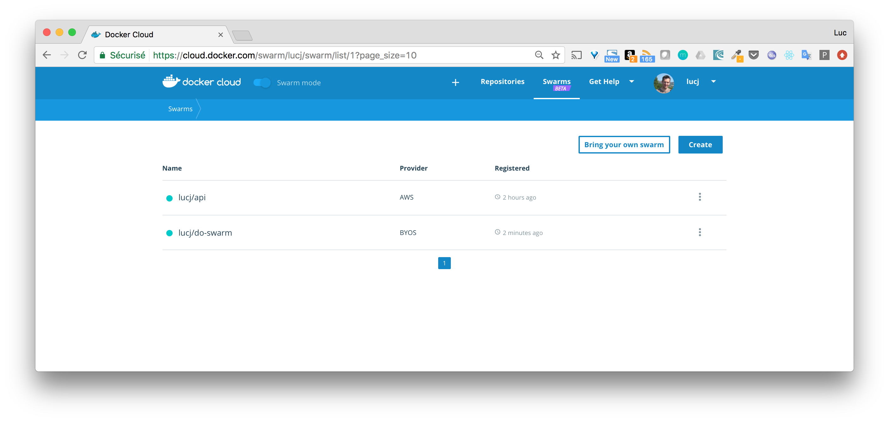

# Summary

I hope this quite detailed view of Docker Cloud will make you want to give it a try.
The solution is very user friendly and easy to use.

